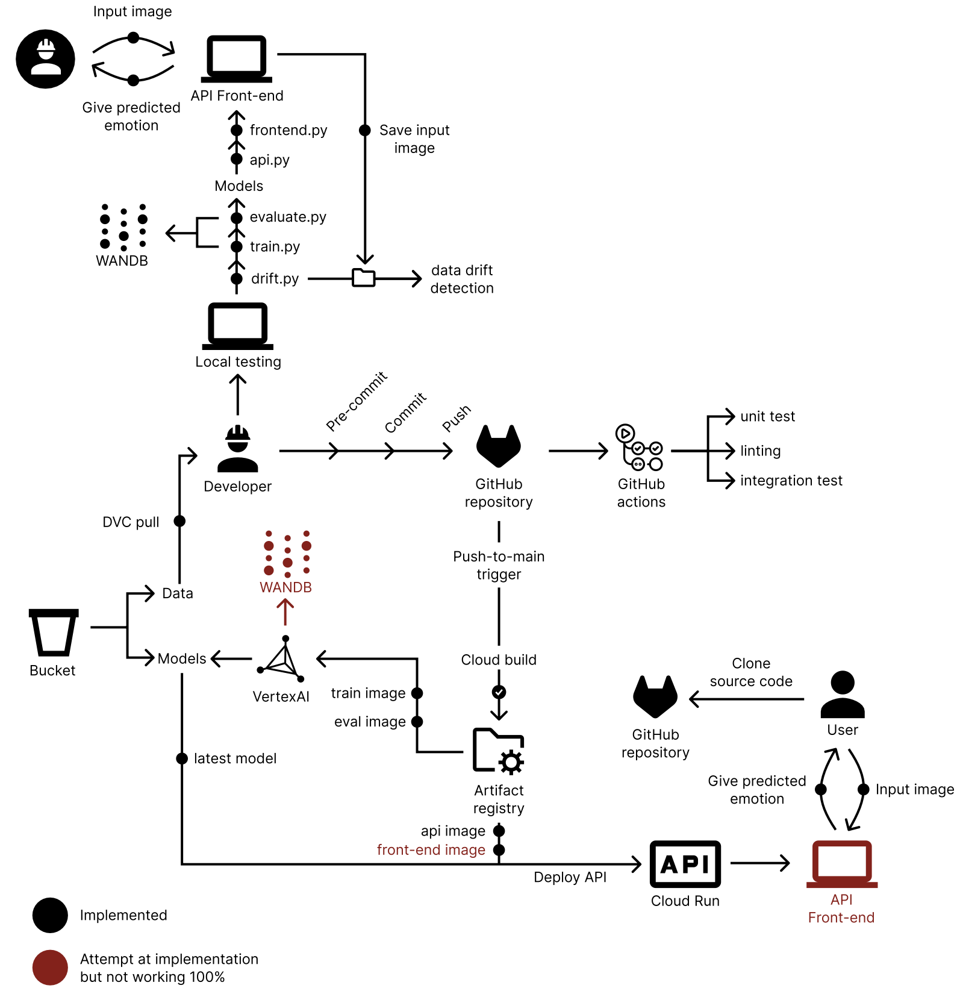

# Convolutional Neural Network Classifying Emotions from Faces

This repository contains the implementation for our Machine learning operations project at DTU (course 02476), where we implement a Convolutional Neural Network (CNN) capable of classifying emotions in images using the [Human Face Emotions](https://www.kaggle.com/datasets/samithsachidanandan/human-face-emotions/data/code/code) dataset. Our code and experiments are included in the repository. This project is built using the cookie-cutter template as a standardized structured framework to run the project as simply as possible.

## Authors
| Name | Student ID |
|------|------------|
| Jacob Borregaard Eriksen | s181487 |
| Liv Dreyer Johansen | s214613 |
| Nikolaj Hertz | s214644 |
| Signe Djernis Olsen | s206759 |

## How to clone our source code
To clone our source code and use it to run your own experiments, please follow the following steps:

1) Clone this repository using 'git clone https://github.com/mlops-group12/MLOpsProject.git'. Go in to the cloned repo 'cd MLOpsProject'.
2) Initialize a virtual environment using 'python3 -m venv .venv'. Optional: deactivate base environment using 'conda deactivate'. Activate your environment 'source .venv/bin/activate'.
3) Update your environment with the necessary dependencies by 'uv sync'.
4) Use 'dvc pull' to pull the data down locally on your computer using DVC.

## The overall architecture of our system


## Overall Goal of the Project
The goal of this project is to design, implement and evaluate a Convolutional Neural Network capable of classifying emotions in images of human faces. The model will take an image as input and output a five-dimensional probability vector that represents the likelihood of the image belonging to each of the predefined classes. The Human Face emotion dataset from Kaggle, which contains images from five distinct classes corresponding to the emotions: angry, happy, sad, fear, and surprised.

## Framework
The project will be implemented using PyTorch as the core deep learning library. To improve code structure and reduce boilerplate code related to training and validation loops, PyTorch Lightning will be used as a high-level framework built on top of PyTorch. PyTorch Lightning will be integrated into the project to manage training, validation and logging while preserving the underlying PyTorch model definitions.

## Data
The project will use the [Human Face Emotions](https://www.kaggle.com/datasets/samithsachidanandan/human-face-emotions/data/code/code) dataset, which consists of 59.099 images divided into 5 classes. The raw data varied in size, so we preprocessed it by resizing all images to 64×64 pixels and converting them to greyscale, since most were already in that format. The dataset is split into 80% training images, 10% validation images and 10% test images.

## Model
The Convolutional Neural Network will be based on common computer vision principles. Initially, the data is passed through several convolutional blocks, including batch-normalization and ReLU. At appropriate places, the blocks will be joined by pooling layers. After this feature extraction, a fully connected network will follow. This will output the aforementioned 5-dimensional output vector, allowing us to obtain class probabilities.

## Project structure

The directory structure of the project looks like this:
```txt
├── .dvc/                     # dvc folder
├── .github/                  # Github actions and dependabot
│   ├── dependabot.yaml
│   └── workflows/
│       └── tests.yaml
├── celeba/                   # dataset for data drifting tests
├── configs/                  # Configuration files
│   ├── base_config.yaml
│   └── drift_config.yaml
├── dockerfiles/              # Dockerfiles
│   ├── api.Dockerfile
│   ├── entrypoint.sh
│   ├── evaluate.Dockerfile
│   ├── frontend.Dockerfile
│   └── train.Dockerfile
├── docs/                     # Documentation
│   ├── mkdocs.yml
│   └── source/
│       └── index.md
├── models/                   # Trained models
├── reports/                  # Reports
│   ├── figures/
│   └── README.md
├── src/                      # Source code
│   ├── mlopsproject/
│   │   ├── __init__.py
│   │   ├── api.py
│   │   ├── data.py
│   │   ├── drift.py
│   │   ├── evaluate.py
│   │   ├── frontend.py
│   │   ├── models.py
│   │   ├── prediction_database.csv
│   │   ├── train.py
│   │   └── visualize.py
├── tests/                    # Tests
│   ├── integrationtests
│   │   ├── test_apis.py
│   │   └── test_integration_model.py
│   ├── performancetests
│   │   └── locustfile.py
│   ├── unittests
│   │   ├── test_data.py
│   │   └── test_model.py
│   └── __init__.py
├── train_data/                     # Data directory
│   ├── Angry
│   ├── Fear
│   ├── Happy
│   ├── Sad
│   └── Surprise
├── wandb/                    # Weight and Biases
├── .dvcignore
├── .gitignore
├── .pre-commit-config.yaml
├── celeba.dvc                # data drift dataset metafile from dvc
├── cloudbuild.yaml           # Build images
├── LICENSE
├── profile.prof              # profiling report
├── pyproject.toml            # Python project file
├── README.md                 # Project README
├── tasks.py                  # Project tasks
├── train_data.dvc            # train dataset metafile from dvc
└── uv.lock                   # Project requirements
```


Created using [mlops_template](https://github.com/SkafteNicki/mlops_template),
a [cookiecutter template](https://github.com/cookiecutter/cookiecutter) for getting
started with Machine Learning Operations (MLOps).
